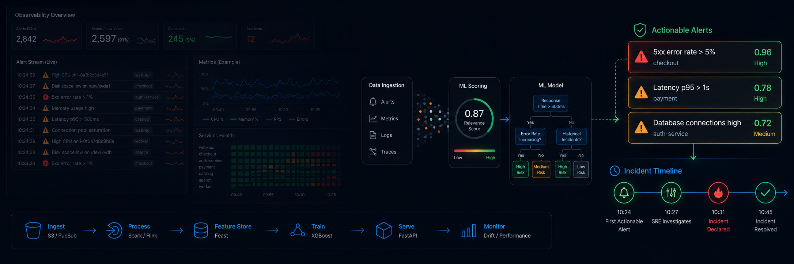
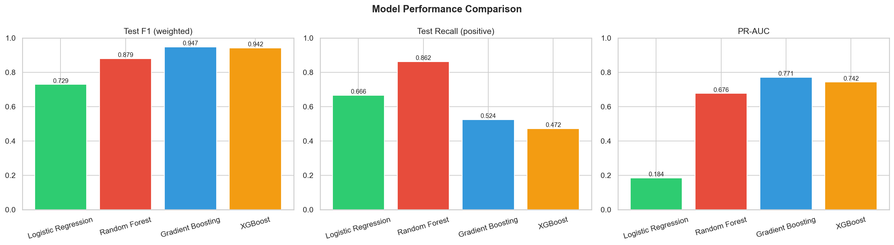
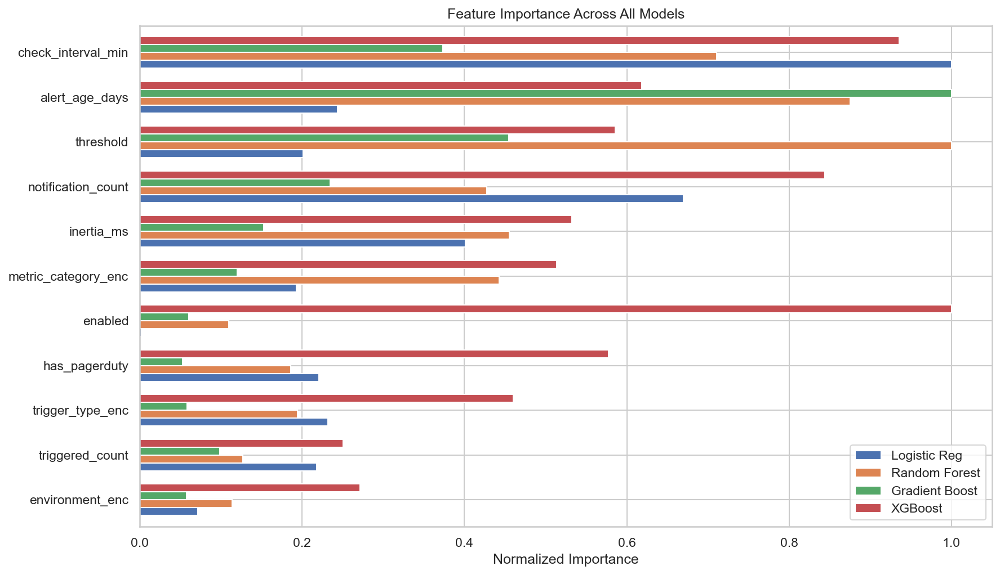
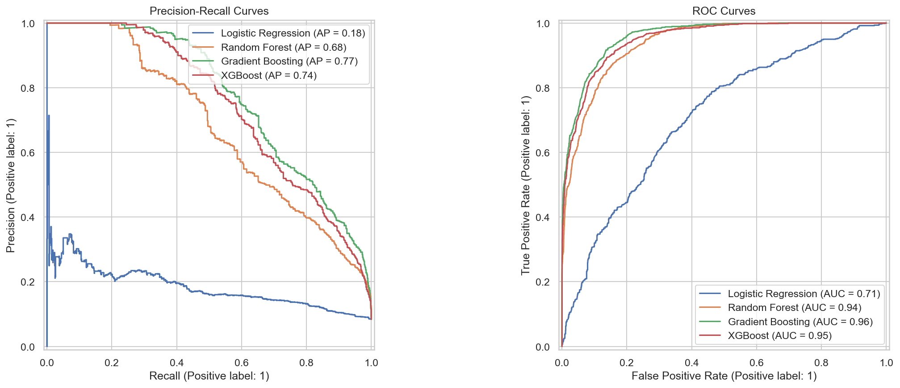

  

### Reducing Alert Noise: Predicting Which Monitoring Alerts Lead to Real Incidents

**Author:** Edgar Mercado

#### Executive summary

Engineering teams in cloud environments are drowning in alert notifications. With thousands of monitoring alerts configured across services, the vast majority are noise - they fire without indicating a real problem, or they never fire at all. This project analyzes over 46,000 alert configurations and links them to real PagerDuty incident data to identify which characteristics make an alert likely to lead to a real incident. Using machine learning, we built models that predict incident-prone alerts based on their configuration alone, giving teams a way to prioritize tuning and reduce alert fatigue before problems escalate.

**Key finding**: Only ~8% of alerts are linked to real PagerDuty incidents. Gradient Boosting achieves a PR-AUC of 0.771 with 84% precision - when it flags an alert as incident-prone, it's right 84% of the time. The most important predictors are PagerDuty integration, threshold settings, alert age, metric category, and historical trigger count.

#### Rationale

Alert fatigue is a well-documented problem in operations. When engineers receive too many irrelevant notifications, they start ignoring alerts altogether - including the ones that matter. This leads to slower incident response times, longer outages, and burned-out on-call teams.

By understanding which alert characteristics are associated with real incidents, organizations can:
- Proactively flag risky alert configurations before they go live
- Identify existing alerts that need tuning or removal
- Reduce mean time to respond (MTTR) by improving signal-to-noise ratio
- Lower on-call burden and engineer burnout

#### Research Question

What characteristics of a monitoring alert's configuration (metric type, threshold, environment, check frequency, notification setup) are most predictive of that alert leading to a real incident, and can we build a model to score new alerts at creation time?

#### Data Sources

- **Alert configurations**: 46,559 monitoring alert configurations from a cloud infrastructure environment (anonymized), with fields including alert expressions, trigger thresholds, check intervals, PagerDuty integration status, notification channels, creation/modification dates, and historical trigger counts
- **PagerDuty incidents**: 2,035 real incidents over 29 days (May-June 2026), linked to alerts via product+service identifiers
- **Target variable**: Derived from PagerDuty incident data - an alert is labeled "incident-prone" if its product+service combination triggered actionable pages (<=10 incidents/month, filtering out chronic noise from misconfigured alerts). This yields ~3,800 positives vs ~42,000 negatives (11:1 imbalance).

#### Methodology

**Data Preparation**
- Removed 598 duplicate records, leaving 45,961 unique alert-trigger pairs
- Engineered features from raw configuration data: metric category (17 types parsed from alert expressions), environment (extracted from alert names), check interval (converted from cron syntax), alert age, notification count, and triggered count
- Linked alerts to PagerDuty incidents using service identifiers, filtering to actionable incidents (<=10/month) to separate signal from chronic noise

**Exploratory Analysis**
- 93.4% of alert-trigger pairs have never fired
- Production accounts for ~81% of all alerts
- Non-PagerDuty alerts have higher mean trigger counts, suggesting PD-connected alerts are better maintained
- Isolation Forest flagged ~5% as statistical outliers
- Improved metric classification reduced the catch-all "other" category from 38% to ~11%

**Modeling**
- Trained four models: Logistic Regression, Random Forest, Gradient Boosting, and XGBoost
- Each tuned with 5-fold stratified cross-validation and GridSearchCV
- Evaluated using weighted F1-score and Precision-Recall AUC (more informative than ROC-AUC for imbalanced problems)

#### Results

| Model | Weighted F1 | Recall (incident-prone) | Precision (incident-prone) | PR-AUC |
|-------|-------------|------------------------|---------------------------|--------|
| Logistic Regression | 0.729 | 0.666 | 0.148 | 0.184 |
| Random Forest | 0.879 | 0.862 | 0.349 | 0.676 |
| **Gradient Boosting** | **0.947** | **0.524** | **0.843** | **0.771** |
| XGBoost | 0.942 | 0.472 | 0.845 | 0.742 |

Gradient Boosting is the best overall model (PR-AUC 0.771). Tuning its classification threshold from 0.5 to 0.245 improves recall from 52% to 65% while maintaining 71% precision - a strong operating point for production use.

**Top predictive features** (consistent across all models):
1. PagerDuty integration - strongest signal; PD alerts behave fundamentally differently
2. Threshold value - extreme thresholds correlate with problematic alerts
3. Alert age - older alerts may be stale or miscalibrated
4. Metric category - infrastructure metrics (memory, CPU) generate more noise than application metrics
5. Triggered count - historical firing frequency correlates with future incident likelihood

All models show minimal overfitting - the gap between training and cross-validation scores is less than 1% for every model.

#### Next steps

1. **RCA severity weighting** - Enrich the target with severity labels from 727 Root Cause Analysis documents (Sev1/Sev2 incidents should weigh more heavily)
2. **Feature expansion** - Extract aggregation windows and specific metric names from alert expressions for finer-grained prediction
3. **SMOTE oversampling** - Address class imbalance with synthetic minority examples (Chawla et al., 2002)
4. **SHAP explainability** - Use SHAP values to explain individual predictions (Lundberg & Lee, 2017)
5. **Deployment as a scoring service** - Integrate the model into the alert creation workflow for real-time quality scoring
6. **Temporal validation** - Test on a future time window to ensure generalization beyond the training period

#### Outline of project

- [Exploratory Data Analysis](EDA.ipynb)
- [Modeling](Modeling.ipynb)

##### Contact and Further Information

Edgar Mercado - [edgar.mercado.us@gmail.com](mailto:edgar.mercado.us@gmail.com)
